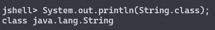
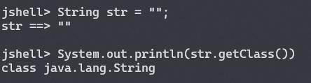

# Java 安全学习 Day1 -- 基础知识


## 0x00 前言

这个暑假一定学 Java  --  🌟


## 0x01 反射

反射式编程是指计算机程序在运行时（runtime）可以访问、检测和修改它本身状态或行为的一种能力。

在 Java 中，反射指在运行期间得到一个对象（所属的类）的所有信息，并对对象的属性和方法进行调用等功能。


### Class 类

除了八种基本类型外，Java 中其它全部类型都是 class（包括 interface，下同）。

JVM 在程序运行过程中会将 class 动态加载进内存中，而每一个加载进内存的 class 本质上都是 `java.lang.Class` 类型的一个实例，该实例中包含了 class 的所有信息，通过获取该实例即可达到动态调用对象属性和方法的功能。

获取 Class 实例一般有三种方法：

1. class 静态变量

   JVM 中每一个已经加载的类，都会有一个名为 `class` 的静态变量，该变量储存了对应的 Class 实例。

   

2. getClass 方法

   JVM 中每一个类的实例对象，都会有一个名为 `getClass` 的方法，通过调用该方法可以得到该类对应的 Class 实例。

   

3. Class.forName 方法

   `java.lang.Class` 类型有一个静态方法 `forName`，该方法接收一个 `String` 参数，参数为一个 class 的完整类名（如 `java.lang.String`），返回该类名对应的 Class 实例。

   

Class 类提供了以下方法用于获取 class 的基本信息（OpenJDK Runtime Environment AdoptOpenJDK-11.0.11+9）

```java
public native boolean isInstance(Object obj);
public native boolean isAssignableFrom(Class<?> cls);
public native boolean isInterface();
public native boolean isArray();
public native boolean isPrimitive();
public boolean isAnnotation();
public boolean isSynthetic();
public String getName();
public ClassLoader getClassLoader();
public Module getModule();
public TypeVariable<Class<T>>[] getTypeParameters();
public native Class<? super T> getSuperclass();
public Type getGenericSuperclass();
public Package getPackage();
public String getPackageName();
public Class<?>[] getInterfaces();
public Type[] getGenericInterfaces();
public Class<?> getComponentType();
public native int getModifiers();
public native Object[] getSigners();
public Method getEnclosingMethod();
public Constructor<?> getEnclosingConstructor();
public Class<?> getDeclaringClass();
public Class<?> getEnclosingClass();
public String getSimpleName();
public String getTypeName();
public String getCanonicalName();
public boolean isAnonymousClass();
public boolean isLocalClass();
public boolean isMemberClass();
public Class<?>[] getClasses();
public Field[] getFields();
public Method[] getMethods();
public Constructor<?>[] getConstructors();
public Field getField(String name);
public Method getMethod(String name, Class<?>... parameterTypes);
public Constructor<T> getConstructor(Class<?>... parameterTypes);
public Class<?>[] getDeclaredClasses();
public Field[] getDeclaredFields();
public Method[] getDeclaredMethods();
public Constructor<?>[] getDeclaredConstructors();
public Field getDeclaredField(String name);
public Method getDeclaredMethod(String name, Class<?>... parameterTypes);
public Constructor<T> getDeclaredConstructor(Class<?>... parameterTypes);
```

一些常用方法的使用如下

```plain
String.class.isInstance("")
true

String.class.isInterface()
false

String.class.isInterface()
false

String.class.getName()
java.lang.String

String.class.getSimpleName()
String

String.class.getModule()
module java.base

String.class.getPackage()
package java.lang
```


### Field 类

通过 Class 实例的 `getField` 和 `getDeclaredField` 等方法，可以获取字段对应的 Field 实例，用于获取字段的基本信息。

Field 类提供了以下方法用于获取字段的基本信息（OpenJDK Runtime Environment AdoptOpenJDK-11.0.11+9）

```java
public Class<?> getDeclaringClass();
public String getName();
public int getModifiers();
public Class<?> getType();
```

一些常用方法的使用如下

```plain
class Test {
    public String a;
    public int b;
}

Test.class.getField("a")
public java.lang.String Test.a

Test.class.getField("a").getName()
a

Test.class.getField("a").getType()
class java.lang.String

Test.class.getField("a").getDeclaringClass()
class Test
```

Field 类还提供了一些方法用于操作实例中的字段

```java
public Object get(Object obj);
public void set(Object obj, Object value)
```


### Method 类

通过 Class 实例的 `getMethod` 和 `getDeclaredMehtod` 等方法，可以获取方法对应的 Method 实例，用于获取方法的基本信息。

Method 类提供了以下方法用于获取方法的基本信息（OpenJDK Runtime Environment AdoptOpenJDK-11.0.11+9）

```java
public Class<?> getDeclaringClass();
public String getName();
public int getModifiers();
public Class<?> getReturnType();
public Class<?>[] getExceptionTypes();
public int getParameterCount();
public Class<?>[] getParameterTypes();
public Object getDefaultValue();
```

一些常用方法的使用如下

```plain
class Test {
    public String a(String b) {
        return b;
    }
}

Test.class.getMethod("a", String.class)
public java.lang.String Test.a(java.lang.String)

Test.class.getMethod("a", String.class).getName()
a

Test.class.getMethod("a", String.class).getReturnType()
class java.lang.String

Test.class.getMethod("a", String.class).getParameterCount()
1

Test.class.getMethod("a", String.class).getParameterTypes()
Class[1] { class java.lang.String }

Test.class.getMethod("a", String.class).getDeclaringClass()
class Test
```

Field 类还提供了方法用于至今调用实例的方法

```java
public Object invoke(Object obj, Object... args);
```


### 通过 Class 实例创建类的实例

1. `newInstance` 方法

   该方法只能调用类的无参数 public 构造方法创建新的实例。

2. 通过 `getConstructor` 获取构造方法

   通过 `getConstructor` 获取类的其它构造方法，其参数为构造方法参数类型对应的 Class 实例，再调用构造方法的 `newInstance` 方法创建实例。

   


### 动态代理

正常情况下，Java 不允许直接创建一个接口的实例，而是必须创建一个类实现该接口，再创建该类的实例。

```java
interface In {
    public String a();
}

static class Test implements In {
    @Override
    public String a() {
        return "Test";
    }
}

public static void main(String[] args) {
    In in = new Test();
    System.out.println(in.a());
}
```

而 Java 标准库提供了动态代理机制，不需要提前编写实现类，而是在运行期间动态创建接口的实例，上述代码可以用以下动态代理的方法实现

```java
interface In {
    public String a();
}

public static void main(String[] args) {
    InvocationHandler handler = new InvocationHandler() {
        @Override
        public Object invoke(Object proxy, Method method, Object[] args) throws Throwable {
            if (method.getName().equals("a")) {
                return "Test";
            }
            return null;
        }
    };
    In in = (In) Proxy.newProxyInstance(
        In.class.getClassLoader(),
        new Class[] { In.class },
        handler
    );
    System.out.println(in.a());
}
```

动态代理机制在运行期间动态创建 class 字节码并加载进内存，以起到类似创建接口实例的效果。


## 0x02 ClassLoader 机制

JVM 在类初始化时，会使用 `java.lang.ClassLoader` 加载 class 字节码，以创建 Class 实例将 class 加载进内存。

JVM 中顶层类加载器有 `Bootstrap ClassLoader`、`Extension ClassLoader` 和 `App ClassLoader`，默认情况下，用户创建的类会使用 `App ClassLoader` 进行加载。


### ClassLoader 类

ClassLoader 类有以下核心方法

```java
public Class<?> loadClass(String name);
protected Class<?> findClass(String name);
protected final Class<?> findLoadedClass(String name);
protected final Class<?> defineClass(String name, byte[] b, int off, int len, ProtectionDomain protectionDomain);
protected final void resolveClass(Class<?> c);
```

其中 `loadClass` 方法通过类的完整名称加载类，与 Class 类中的 `forName` 方法类似。


## 0x03 注解

注解是放在 Java 源码的类、方法、字段、参数前的一种特殊“注释“，会被放入 class 字节码中，可以在运行时获取并处理注解。


## 0x04 序列化与反序列化

如果一个类实现了 `java.io.Serializable` 接口，那么它的实例就是可序列化的，可以通过 `ObjectOutputStream` 类的 `writeObject` 方法实现序列化，通过 `ObjectInputStream` 类的 `readObject` 方法实现反序列化。

一个类的实例在进行反序列化时，会调用 `java.io.Serializable` 接口的 `readObject` 方法，如果该方法中存在可以利用的函数，即存在反序列化漏洞。


## 0x05 总结与展望（误

后续应该就是分析一下 [ysoserial](https://github.com/frohoff/ysoserial) 里的各种链，然后复现一下常见框架的 CVE，希望不咕（
