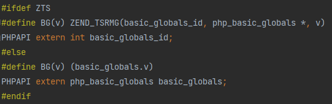
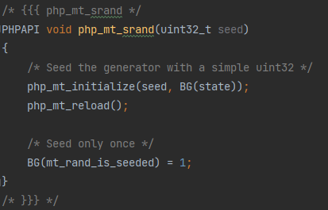
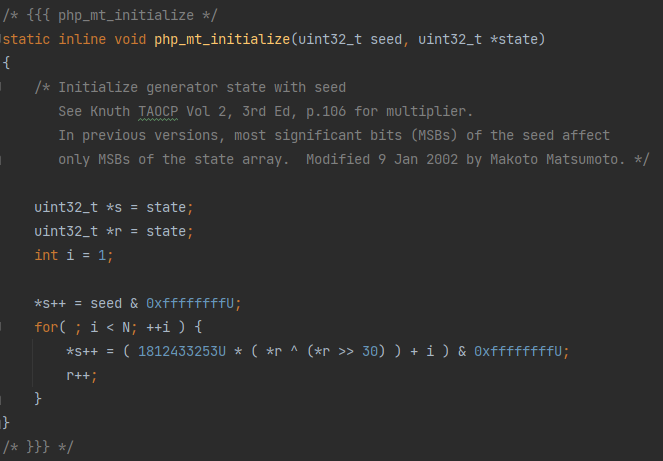
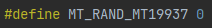
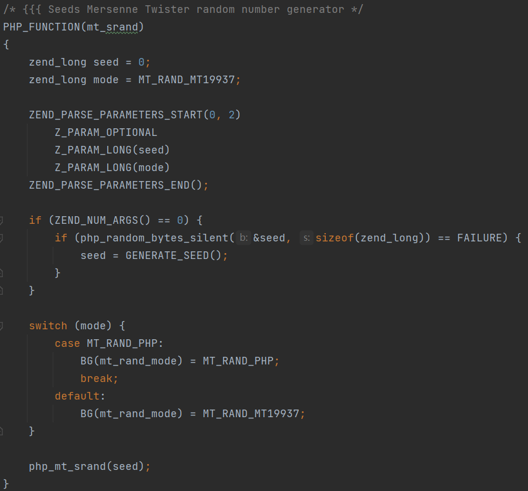
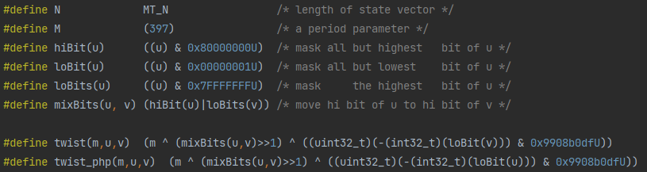
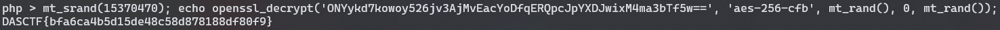

# 还原 PHP mt_rand 种子


## 0x00 前言

今年国赛分区赛遇到一个还原 PHP mt_rand 种子的题（由于太菜了 break 的时候根本没有做到这一步

这一部分的源码是这样的

```php
<?php
foreach (scandir('.') as $i) {
    if (strlen($i) === 36) {
        include $i;
    }
}
if (!isset($_GET['pass'])) {
    echo $style3."需要登录</br>\n";
    die($form);
}
if ($_GET['pass'] !== 'nya_nop_nya~') {
    echo $style3."密码错误. 为什么不回去看看呢?</br>\n";
    die($form);
}
echo $style2;
mt_srand(rand(10000000, 99999999));
echo "<nya>你要的flag!</br>\n";
echo openssl_encrypt($flag, 'aes-256-cfb', mt_rand(), 0, mt_rand());
echo "\n</br>看不懂?不如来抽卡吧!</br>\n" . $form2;
for ($i = 0; $i < $_GET['roll']; $i += 1) {
    echo mt_rand() . " ";
}
echo "\n</nya>";
```

通过后续产生的随机数还原出随机数种子，然后得到加密的密钥和 IV

这里有两种攻击思路：第一种就是爆破，反正种子就 8 位整数，爆破就是费点时间；第二种就是通过 mt_rand 的规律还原种子

之前看到过大佬写的不用爆破还原随机数种子的文章：[BREAKING PHP'S MT_RAND() WITH 2 VALUES AND NO BRUTEFORCE](https://www.ambionics.io/blog/php-mt-rand-prediction)，这里跟着大佬的思路自己分析一下


## 0x01 从源码开始

`mt_rand` 相关的函数在 `ext/stadard/mt_rand.c` 中，其中 `mt_rand` 对应的函数如下


其中 BG 宏的定义在 `ext/standard/mt_rand.c` 中，大概就是获取类似全局变量的东西



用于设置随机数种子的 `php_mt_srand` 的源码如下



其中 `state` 变量为初始化后的状态向量，储存产生的随机数

`php_mt_initialize` 和 `php_mt_reload` 的源码如下




其中 MT_RAND_MT19937 定义在 `ext/standard/php_mt_rand.h` 中



选择模式的操作在 `mt_srand` 函数中，默认为 MT19937 模式使用 `twist` 宏，若选择 1 则为 PHP 模式使用 `twist_php` 宏



其中一些全局变量和宏的定义如下



`MT_N` 定义在 `ext/standard/basic_functions.h` 中，为初始化产生的状态向量的长度


`php_mt_initialize` 函数的作用很简单，产生初始的状态向量，每个值都由它前一个值生成，第一个值为输入的种子

`php_mt_reload` 函数对初始状态向量进行混合，产生 N 个新的值作为被 mt_rand 使用的随机数

`php_mt_rand` 函数再对这些值进行简单的处理生成最终的随机数


## 0x02 从后往前看

### mt_rand

首先从被调用的 `mt_rand` 开始分析，`mt_rand` 返回的随机数为 `php_mt_rand` 返回值右移一位

```c
RETURN_LONG(php_mt_rand() >> 1);
```

由于右移后其最低位丢失，故一个输出的随机数对应两种可能的 `php_mt_rand` 返回值，其最低位分别为 0 和 1

### php_mt_rand

`php_mt_rand` 返回值为经过处理的 `php_mt_reload` 中产生的值，其中进行处理的代码如下

```c
s1 ^= (s1 >> 11);
s1 ^= (s1 <<  7) & 0x9d2c5680U;
s1 ^= (s1 << 15) & 0xefc60000U;
return ( s1 ^ (s1 >> 18) ); // s1 ^= (s1 >> 18);
```

这四条代码均为可逆操作

- `s1 ^= (s1 >> 11)`

  结果高 11 位与原值高 11 位相同，结果低 21 位为原值高 21 位与低 21 位异或结果

  故其逆操作如下

  ```c
  s1 ^= (s1 >> 11); // 恢复 10~20 位
  s1 ^= (s1 >> 22); // 恢复 0~9 位 (低 10 位)
  ```

- `s1 ^= (s1 <<  7) & 0x9d2c5680U`

  其逆操作如下

  ```c
  s2 = (s1 << 21) ^ (((s1 << 7) & 0x9d2c5680U) << 21); // 恢复高 11 位
  s2 = (s1 << 14) ^ (s2 & (0x9d2c5680U << 14)); // 恢复 14~20 位
  s2 = (s1 << 7) ^ (s2 & (0x9d2c5680U << 7)); // 恢复 7~13 位
  s1 ^= s2 & 0x9d2c5680U; // 恢复低 7 位
  ```

- `s1 ^= (s1 << 15) & 0xefc60000U`

  结果高 16 位为原值 1~16 位与 `0xefc6` 相与并与原值高 16 位异或的结果，低 16 位与原值低 16 位相同

  故其逆操作与原操作相同

  ```c
  s1 ^= (s1 << 15) & 0xefc60000U; // 恢复高 16 位
  ```

- `s1 ^= (s1 >> 18)`

  结果高 18 位与原值高 18 位相同，结果低 14 位为原值高 14 位与低 14 位异或结果

  故其逆操作与原操作相同

  ```c
  s1 ^= (s1 >> 18); // 恢复低 14 位
  ```

结合以上四步得到 `php_mt_rand` 中处理操作的逆操作

```c
uint32_t reverse_php_mt_rand(uint32_t s1) {
    s1 ^= (s1 >> 18);
    
    s1 ^= (s1 << 15) & 0xefc60000U;
    
    s2 = (s1 << 21) ^ (((s1 << 7) & 0x9d2c5680U) << 21);
    s2 = (s1 << 14) ^ (s2 & (0x9d2c5680U << 14));
    s2 = (s1 << 7) ^ (s2 & (0x9d2c5680U << 7));
    s1 ^= s2 & 0x9d2c5680U;
    
    s1 ^= (s1 >> 11);
    s1 ^= (s1 >> 22);
    return s1;
}
```

### php_mt_reload

代码中的循环分为两部分，输出状态向量中前 N-M (227) 个值与后 M (397) 个值的产生方法不同

且对于后 M (397) 个值，`state_reload[i]` 与 `state_reload[i-227]` 存在一定的关联，即

```c
state_reload[i] = twist(state_reload[i-227], state[i], state[i+1])
```

其中用到的宏如下

```c
#define hiBit(u)      ((u) & 0x80000000U)  /* mask all but highest   bit of u */
#define loBit(u)      ((u) & 0x00000001U)  /* mask all but lowest    bit of u */
#define loBits(u)     ((u) & 0x7FFFFFFFU)  /* mask     the highest   bit of u */
#define mixBits(u, v) (hiBit(u)|loBits(v)) /* move hi bit of u to hi bit of v */
#define twist(m,u,v)  (m ^ (mixBits(u,v)>>1) ^ ((uint32_t)(-(int32_t)(loBit(v))) & 0x9908b0dfU))
#define twist_php(m,u,v)  (m ^ (mixBits(u,v)>>1) ^ ((uint32_t)(-(int32_t)(loBit(u))) & 0x9908b0dfU))
```

- **MT_RAND_MT19937 模式**

  对于右半部分，当 `state[i+1]` 最低位为 0 时，右半部分为 0，当 `state[i+1]` 最低位为 1 时，右半部分为 0x9908b0dfU

  由于 0x9908b0dfU 最高位为 1，所以右半部分最高位与 `state[i+1]` 最低位相同

  又由于 `mixBits(u,v)>>1` 最高位一定为0，若我们已知 `state_reload[i]` 与 `state_reload[i-227]`，则 `state_reload[i] ^ state_reload[i-227]` 最高位与右半部分最高位即与 `state[i+1]` 最低位相同

  进而求出 `mixBits(u,v) >> 1` 的值，该值的低 30 位为 `state[i+1]` 的 1~30 位，30 位为 `state[i]` 的最高位

  此时我们已知 `state[i+1]` 的低 31 位，则该值共有两种情况，我们可以根据这两种情况分别求出对应的种子 (通过分析 `php_mt_initialize` 函数)，利用该种子生成的 `state_reload` 与已知值比较，确定正确的种子值

- **MT_RAND_PHP 模式**

  由于右半部分最高位与 `state[i]` 最高位相同，所以可以只能得到 `state[i+1]` 的 1~31 位，共有四种情况

### php_mt_initialize

`php_mt_initialize` 比较简单，每一个值都只与前一个值相关，其生成过程为

```c
state[i] = (0x6c078965U * (state[i-1] ^ (state[i-1] >> 30)) + i) & 0xffffffffU;
```

其中 `& 0xffffffffU` 操作等价于 `% 0X100000000U`

求得 0x6c078965 对于模 0x100000000 的逆为 0x9638806d

故该操作的逆操作为

```c
state[i-1] = (0x9638806dU * (state[i] - i)) & 0xffffffffU;
state[i-1] ^= state[i-1] >> 30;
```


## 0x03 逆操作综合

将各个函数的逆操作综合一下，在我们已知相距 227 的两个随机数 `rand[i]` 与 `rand[i-227]` 和对应的 `i` 的情况下，`state_reload[i]` 与 `state_reload[i-227]` 的取值共有四种组合，对每一种组合分别进行逆操作得到种子，并通过测试确定正确的种子 (一般来说只有一种组合可以得到有效的种子)

简单写了一个 `mt_rand` 种子还原的程序

```c
#include <stdio.h>
#include <stdint.h>

#define N             (624)
#define M             (397)
#define hiBit(u)      ((u) & 0x80000000U)
#define loBit(u)      ((u) & 0x00000001U)
#define loBits(u)     ((u) & 0x7FFFFFFFU)
#define mixBits(u, v) (hiBit(u)|loBits(v))

#define twist(m,u,v)  (m ^ (mixBits(u,v)>>1) ^ ((uint32_t)(-(int32_t)(loBit(v))) & 0x9908b0dfU))
#define twist_php(m,u,v)  (m ^ (mixBits(u,v)>>1) ^ ((uint32_t)(-(int32_t)(loBit(u))) & 0x9908b0dfU))

static inline void php_mt_initialize(uint32_t seed, uint32_t *state) {
    uint32_t *s = state;
    uint32_t *r = state;
    int i = 1;

    *s++ = seed & 0xffffffffU;
    for( ; i < N; ++i ) {
        *s++ = ( 1812433253U * ( *r ^ (*r >> 30) ) + i ) & 0xffffffffU;
        r++;
    }
}

static inline void php_mt_reload(uint32_t *state, uint32_t mode)
{
    uint32_t *p = state;
    int i;

    if (mode == 0) {
        for (i = N - M; i--; ++p)
            *p = twist(p[M], p[0], p[1]);
        for (i = M; --i; ++p)
            *p = twist(p[M-N], p[0], p[1]);
        *p = twist(p[M-N], p[0], state[0]);
    } else {
        for (i = N - M; i--; ++p)
            *p = twist_php(p[M], p[0], p[1]);
        for (i = M; --i; ++p)
            *p = twist_php(p[M-N], p[0], p[1]);
        *p = twist_php(p[M-N], p[0], state[0]);
    }
}

uint32_t reverse_php_mt_rand(uint32_t s1) {
    uint32_t s2;

    s1 ^= (s1 >> 18);

    s1 ^= (s1 << 15) & 0xefc60000U;

    s2 = (s1 << 21) ^ (((s1 << 7) & 0x9d2c5680U) << 21);
    s2 = (s1 << 14) ^ (s2 & (0x9d2c5680U << 14));
    s2 = (s1 << 7) ^ (s2 & (0x9d2c5680U << 7));
    s1 ^= s2 & 0x9d2c5680U;

    s1 ^= (s1 >> 11);
    s1 ^= (s1 >> 22);
    return s1;
}

uint32_t reverse_php_mt_initialize(uint32_t si, uint32_t i) {
    for (uint32_t j = i; j > 0; j--) {
        uint32_t temp = (0x9638806dU * (si - j)) & 0xffffffffU;
        si = temp ^ (temp >> 30);
    }
    return si;
}

uint32_t reverse_php_mt_reload_0(uint32_t sri, uint32_t sri_227, uint32_t i) {
    uint32_t si_1_lsb = (sri ^ sri_227) >> 31; // LSB of state[i+1]
    uint32_t mix = (sri ^ sri_227) ^ (si_1_lsb ? 0x9908b0dfU : 0);
    uint32_t si_1_31 = (mix << 2 >> 1) | si_1_lsb; // 0~30 bits of state[i+1]

    for (uint32_t h = 0; h < 2; h++) {
        uint32_t si_1 = si_1_31 | (h << 31);
        uint32_t seed = reverse_php_mt_initialize(si_1, i + 1);
        uint32_t state[N];
        php_mt_initialize(seed, state);
        php_mt_reload(state, 0);
        if (state[i-227] == sri_227) {
            return seed;
        }
    }

    return 0;
}

uint32_t reverse_php_mt_reload_1(uint32_t sri, uint32_t sri_227, uint32_t i) {
    uint32_t si_lsb = (sri ^ sri_227) >> 31; // LSB of state[i]
    uint32_t mix = (sri ^ sri_227) ^ (si_lsb ? 0x9908b0dfU : 0);
    uint32_t si_1_1_30 = mix << 2 >> 1; // 1~30 bits of state[i+1]

    for (uint32_t h = 0; h < 2; h++) {
        for (uint32_t l = 0; l < 2; l++) {
            uint32_t si_1 = si_1_1_30 | l | (h << 31);
            uint32_t seed = reverse_php_mt_initialize(si_1, i + 1);
            uint32_t state[N];
            php_mt_initialize(seed, state);
            php_mt_reload(state, 1);
            if (state[i-227] == sri_227) {
                return seed;
            }
        }
    }

    return 0;
}

int main() {
    uint32_t i; // index of one random number
    uint32_t ri_227; // rand[i-227]
    uint32_t ri; // rand[i]
    uint32_t mode; // 0 for MT_RAND_MT19937 / 1 for MT_RAND_PHP

    printf("i(>=227):");
    scanf("%u", &i);
    printf("rand[i-227]([%u]):", i - 227);
    scanf("%u", &ri_227);
    printf("rand[i]([%u]):", i);
    scanf("%u", &ri);
    printf("mode(0/1):");
    scanf("%u", &mode);

    for (uint32_t a = 0; a < 2; a++) {
        for (uint32_t b = 0; b < 2; b++) {
            uint32_t sri = reverse_php_mt_rand((ri << 1) | a);
            uint32_t sri_227 = reverse_php_mt_rand((ri_227 << 1) | b);
            if (mode == 0) {
                printf("%u\n", reverse_php_mt_reload_0(sri, sri_227, i));
            } else {
                printf("%u\n", reverse_php_mt_reload_1(sri, sri_227, i));
            }
        }
    }

    return 0;
}
```


## 0x04 测试

通过 0x01 中的题对上述代码进行简单测试

首先生成 228 个随机数，由于加密时已经生成 2 个随机数，所以此时输出第一个随机数为 `rand[2]`，最后一个随机数为 `rand[229]`

```
/flag.php?pass=nya_nop_nya~&roll=228
```


使用上述代码进行种子还原操作，其中 i 为 229，mode 为 0


比较结果可知，随机数种子应为 `15370470`，使用该种子生成随机数对给定加密信息进行解密即可得到 flag




## 0x05 后记

众所周知，不会密码学的二进制不是一个合格的 Web 手（x


