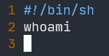
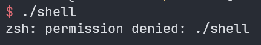
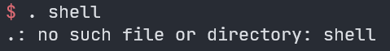
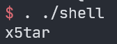
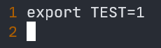

# Linux 中的 source 命令（点命令）

在做题的时候遇到了上传了 shell 脚本但是没有执行权限的情况

测试脚本

本地测试结果

然后就发现了 source 命令

点命令（错误示范）

点命令（必须加 ./）

source 命令和点命令在作用上完全相同

而除了可以不需要执行权限外，source 命令（点命令）还有一个特性，即 source 命令是在本 shell 内执行，而 直接执行脚本是在新开 shell 中执行，即 source 命令可以设置当前 shell 的环境变量，故常用来使修改过的初始化文件（.bashrc .profile 等）立即生效

测试脚本

直接执行

source 命令

点命令

